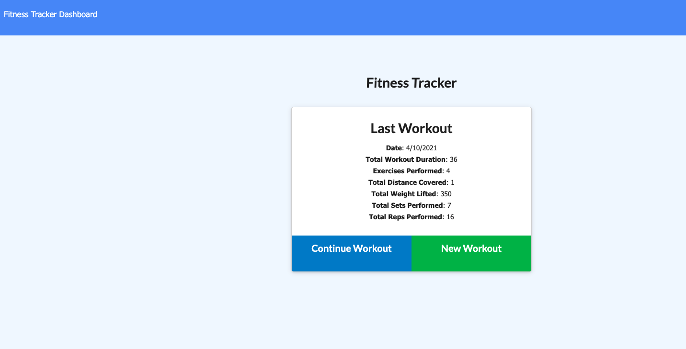
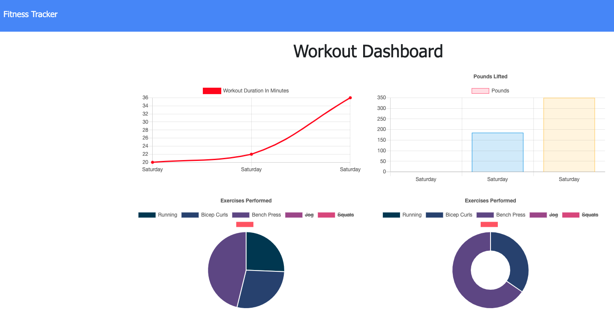

# Workout Tracker

## Description 
This app uses mongoose to host a mongo database that stores workout and data assocatied with the workouts that are input by a user. The homepage shows the current date, total workout minutes, total exercises, total distance covered for cardio workouts, total weight lifted, and total sets and reps for strength workouts. 

### Usage
To use this app, the user should log their first workout by using the green New Workout button. Then select which type of workout (resistance or cardio) and input the relevant data from their workout. Once the user clicks Add Exercise the workout data is added to the database and the dashboard page is automatically updated. The dashboard page displays charts and graphs of the user's workout data so they can easily keep track of their stats. 

### Screenshots
#### Homepage:

#### Dashboard:

### Links
Link to github reposity: https://github.com/gtscott90/workout-tracker
Link to deployed application: https://stormy-river-80275.herokuapp.com/stats
